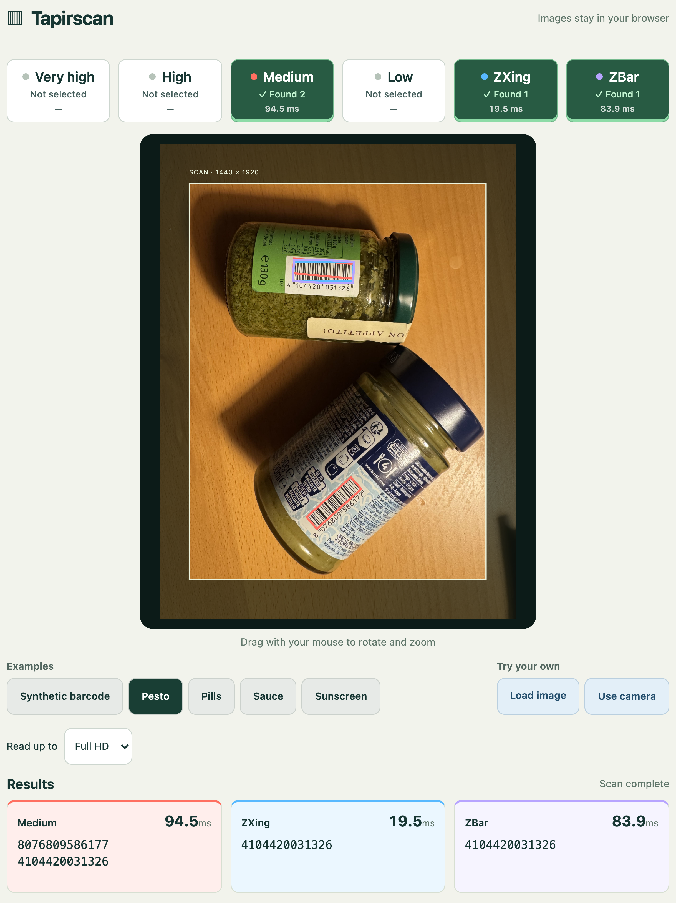

<div align="center">

# Tapirscan

**Find barcodes at their own angle.**

Orientation-aware barcode scanning for JavaScript, Python and Rust.

[Try the live demo](https://tapirscan.netlify.app) · [npm](https://www.npmjs.com/package/tapirscan) · [PyPI](https://pypi.org/project/tapirscan/) · [JavaScript](bindings/javascript/README.md) · [Python](bindings/python/README.md) · [How it works](docs/ARCHITECTURE.md) · [Compare scanners](docs/COMPARISON.md)

</div>

Tapirscan’s AI-developed algorithm finds barcode regions, estimates their orientation,
and samples across the bars, including diagonally. It is built for photos and camera frames where a
clean horizontal or vertical scanline may be hard to find.

**EAN-13, UPC-A, EAN-8 and UPC-E are supported** through the retail group.
Retail formats (EAN13, UPCA, EAN8 and UPCE) are enabled by default. Four effort modes let you choose how much work to
spend on a frame. Formats outside the retail group, including QR Code, remain
**experimental and opt-in**.

- **Find multiple symbols.** Return decoded values and positions in the original image.
- **Keep useful evidence.** Inspect localized regions even when decoding fails.
- **Choose the effort.** `low`, `medium` (default), `high`, or `very-high`.
- **Run locally.** No API key, hosted decoder, neural model, or image upload.
- **Use the same core.** Browser/Node WASM and native Python, Rust, C, C++, and Java bindings.

## Try it

**[Open the camera and photo demo →](https://tapirscan.netlify.app)**

Start with Pesto, choose another example, load a photo, or scan with your camera.
Medium, ZXing and ZBar are enabled initially to compare the same image. Images are
processed in your browser. The demo currently compares **EAN-13 only**.

[](https://tapirscan.netlify.app)

## Language support

| Language                | Integration                                                       | Guide                                  |
| ----------------------- | ----------------------------------------------------------------- | -------------------------------------- |
| JavaScript / TypeScript | Browser and Node, WASM included                                   | [JS/TS](bindings/javascript/README.md) |
| Python                  | Native platform wheels; Pillow, NumPy and tensors                 | [Python](bindings/python/README.md)    |
| Java                    | JDK 22+ JAR with separate native libraries; no Android            | [Java](bindings/java/README.md)        |
| C++                     | C++17 RAII wrapper and CMake installation; one linked effort mode | [C++](bindings/cpp/README.md)          |
| C                       | Shared-library ABI with explicit handles and buffers              | [C](bindings/c/README.md)              |
| Rust                    | Standalone Cargo package; all four runtime effort modes           | [Rust](bindings/rust/README.md)        |

All use the selected release algorithms. Packaging and convenience differ:
Java/C/C++ need native libraries. Rust has a self-contained source package prepared
for crates.io, with typed results and runtime mode selection. JavaScript and Python are available on
[npm](https://www.npmjs.com/package/tapirscan) and [PyPI](https://pypi.org/project/tapirscan/).
The other language guides explain how to build their bindings from source.

Want another language? An AI coding assistant can scaffold a binding from the
C ABI with a single prompt. See [the binding guide](docs/ADDING_BINDINGS.md) for a
starter prompt and the checks needed before using or publishing the result.

## Quick start

Install Tapirscan from [npm](https://www.npmjs.com/package/tapirscan) or
[PyPI](https://pypi.org/project/tapirscan/). See the
[GitHub release](https://github.com/kleinicke/tapirscan/releases/latest) for release notes
and downloadable packages, or [build locally](docs/DEVELOPMENT.md).

### JavaScript / TypeScript

```sh
npm install tapirscan
```

```js
import { scan } from "tapirscan";

// Using an existing canvas and its 2D context:
const image = context.getImageData(0, 0, canvas.width, canvas.height);
const result = await scan(image);
console.log(result.values); // Decoded strings, e.g. ["4006381333931"]
for (const barcode of result.barcodes) {
  console.log(barcode.text, barcode.format, barcode.polygon, barcode.rect);
}
```

`result.values` is a `string[]`; `result.barcodes` is a `Barcode[]` containing
the text, format, four polygon corners, and enclosing rectangle for each read.
Positions use input-image pixels. Both arrays are empty when nothing is decoded.
TypeScript infers these types from the package’s included declarations.

Serve the package's WASM assets with your app. Bundler setup, Node loading, and
worker examples are in the [JavaScript guide](bindings/javascript/README.md).
Scanning is synchronous after initialization; use a worker for a responsive UI.

### Python

Install `tapirscan` plus the image libraries you use. For these examples:

```sh
pip install tapirscan tifffile pillow torch
```

**TIFF → NumPy array, using defaults:**

```python
import tifffile
import tapirscan

pixels = tifffile.imread("label.tif")  # NumPy array
result = tapirscan.scan(pixels)
print(result.values)
```

This example assumes an 8-bit grayscale or RGB image. Defaults are Medium effort
and EAN-13. No intermediate file or explicit scanner object is needed.

**JPEG, with optional settings:**

```python
from PIL import Image
import tapirscan

with Image.open("label.jpg") as image:
    result = tapirscan.scan(image, mode="high", formats="1D")

for barcode in result:
    print(barcode.text, barcode.format, barcode.polygon)
```

`formats="1D"` enables all supported linear formats; `"2D"` and `"all"` are also
available. The retail formats (EAN13, UPCA, EAN8 and UPCE) are supported; formats outside this group remain experimental.

**PyTorch tensor:**

```python
import torch

# Using the NumPy array from the TIFF example:
tensor = torch.from_numpy(pixels)
result = tapirscan.scan(tensor)
print(result.values)
```

GPU tensors and tensors with `requires_grad=True` work directly. Tapirscan
detaches internally and transfers pixels to CPU; your tensor and its autograd
graph are unchanged. Barcode decoding runs on CPU.

See the [Python guide](bindings/python/README.md) for every argument, result
field, and scanner reuse. Install only the optional image libraries you need.

## How it differs from ZXing and ZBar

For EAN-13, the ZXing-C++ reader used by our demo primarily searches horizontal
rows and, with rotation enabled, vertical rows. A tilted barcode can still work
if one of those rows crosses the complete pattern.

ZBar can assemble compatible left- and right-half EAN reads from different
scanlines. Tapirscan instead explicitly localizes oriented regions and samples
along their geometry, with bounded retries and a small-detail recovery pass in
the higher effort modes.

These are different ways of spending work on an image—not a universal speed or
accuracy ranking. **[Read the illustrated comparison and its sources](docs/COMPARISON.md).**

## Choose an effort mode

| Mode        | When to use it                                                          |
| ----------- | ----------------------------------------------------------------------- |
| `low`       | Live camera scanning when keeping up with incoming frames matters most. |
| `medium`    | Start here: the default for photos and camera frames.                   |
| `high`      | Difficult images when you can spend more time on each scan.             |
| `very-high` | Your largest effort budget when latency matters less.                   |

Start with `medium`. Try `low` if scanning slows down your camera preview, or
`high` and `very-high` when an image is difficult to read. Measure on your own
images and devices: higher effort does not guarantee more reads on every image.
See the [architecture guide](docs/ARCHITECTURE.md) for implementation details.

## Formats and results

The supported retail group includes EAN-13, UPC-A, EAN-8 and UPC-E. Select
`formats="retail"` in Python or `formats: "retail"` in JavaScript to enable all
four; Rust provides `Formats::RETAIL`. Retail formats are enabled by default, and
UPC-A uses the same optical path. Opt-in experimental readers outside this group
include Code 128, Code 39, Code 93, ITF, Codabar, DataBar,
DataBar Expanded, QR Code, Data Matrix, PDF417, Aztec, and MaxiCode.

See [format coverage](docs/FORMATS.md) before choosing Tapirscan for a particular
symbology. The four effort modes tune EAN-13/UPC-A, Common1D and QR Code. Other matrix
readers use a fixed effort setting.

Results preserve source-image polygons. Python and JavaScript return all decoded
instances; `result.best` (`result.best()` in Rust) selects the largest reader-specific support. Support is a ranking heuristic, not a probability. `unfinished` reports
incomplete work; it does not invalidate a returned read or promise that another
barcode exists. Wrong reads, duplicates, and missed symbols remain possible.

## Documentation

[Python guide](bindings/python/README.md) · [JavaScript / TypeScript guide](bindings/javascript/README.md): all settings,
defaults, format selection, result geometry, and diagnostic options.

| I want to…                         | Start here                                                                                                                 |
| ---------------------------------- | -------------------------------------------------------------------------------------------------------------------------- |
| Integrate in a browser or Node app | [JavaScript / TypeScript](bindings/javascript/README.md)                                                                   |
| Scan Python images and arrays      | [Python](bindings/python/README.md)                                                                                        |
| Use another native language        | [Rust](bindings/rust/README.md), [C](bindings/c/README.md), [C++](bindings/cpp/README.md), [Java](bindings/java/README.md) |
| Understand the scanner             | [Comparison](docs/COMPARISON.md) · [Architecture](docs/ARCHITECTURE.md)                                                    |
| Evaluate performance fairly        | [Benchmark guide](docs/BENCHMARKS.md)                                                                                      |
| Build or contribute                | [Development](docs/DEVELOPMENT.md) · [Contributing](CONTRIBUTING.md)                                                       |
| Prepare a release                  | [Release checklist](docs/RELEASING.md) · [Changelog](CHANGELOG.md)                                                         |

The demo is a separate application. Its photos, UI, and comparison engines are
not included in the npm package or Python wheels.

## The story behind Tapirscan

Tapirscan’s scanner algorithm was written by GPT-6 Astra, guided by my goals,
experiments, and hands-on testing. I directed the development, checked results,
and refined the evaluation process.

[Read the development story](BLOG_POST.md).

## Project status

This is a young library with supported EAN-13, UPC-A, EAN-8 and UPC-E scanning.
Formats outside the retail group remain experimental. macOS arm64 has been exercised locally; the release workflows must pass
for each additional platform before its artifacts are published. No general
claim of superiority over ZXing or ZBar is made without a reproducible paired
benchmark.

Licensed under the [MIT License](LICENSE), copyright © 2026 Florian Nick.
Third-party components retain their own licenses and
[notices](multiformat/THIRD_PARTY_NOTICES.md). Release preparation is described in the [release checklist](docs/RELEASING.md).

See the [compatibility policy](CONTRIBUTING.md#api-stability)
for API stability and release changes.

Set `extended_budget=True` (Python), `extendedBudget: true` (JavaScript), or
`extended_budget: true` (Rust) to allow extra reader work for any format selection.
Exact budgets may evolve. Today the flag relaxes shared EAN/UPC retry limits;
other readers retain their existing budgets. It does not guarantee exhaustive
search, and `unfinished` may remain true.
