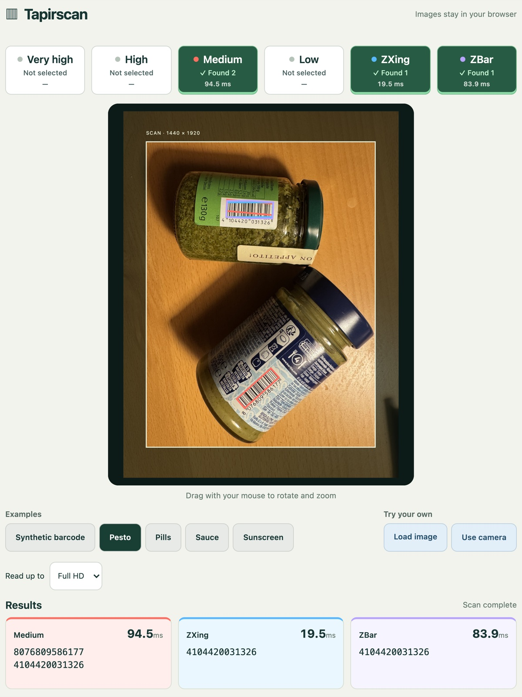

<div align="center">

# Tapirscan

**Find barcodes at their own angle.**

Orientation-aware barcode scanning for JavaScript, Python, Rust, C, C++ and Java.

[Documentation](https://tapirscan.f-kleinicke.de/docs/) · [Try the live demo](https://tapirscan.f-kleinicke.de) · [npm](https://www.npmjs.com/package/tapirscan) · [PyPI](https://pypi.org/project/tapirscan/) · [JavaScript](bindings/javascript/README.md) · [Python](bindings/python/README.md) · [How it works](docs/ARCHITECTURE.md) · [Compare scanners](docs/COMPARISON.md)

</div>

Tapirscan’s AI-developed algorithm finds barcode regions, estimates their orientation,
and samples across the bars, including diagonally. It is built for photos and camera frames where a
clean horizontal or vertical scanline may be hard to find.

**Supports linear and 2D barcodes**, including EAN/UPC, Code 128, QR Code,
Data Matrix, PDF417 and Aztec. Retail formats (EAN-13, UPC-A, EAN-8 and UPC-E) are
enabled by default; select additional formats as needed. See
[format coverage](docs/FORMATS.md) for all formats and variants.

- **Find multiple symbols.** Return decoded values and positions in the original image.
- **Keep useful evidence.** Inspect localized regions even when decoding fails.
- **Choose the effort.** `low`, `medium` (default), `high`, or `very-high`.
- **Run locally.** No API key, hosted decoder, neural model, or image upload.
- **Use the same core.** Browser/Node WASM and native Python, Rust, C, C++, and Java bindings.

## Try it

**[Open the camera and photo demo →](https://tapirscan.f-kleinicke.de)**

Start with Pesto, choose another example, load a photo, or scan with your camera.
Medium, ZXing and ZBar are enabled initially to compare the same image. Images are
processed in your browser. Choose Retail, Common or other format selections to
compare the readers.

[](https://tapirscan.f-kleinicke.de)

## Language support

| Language                | Integration                                            | Guide                                  |
| ----------------------- | ------------------------------------------------------ | -------------------------------------- |
| JavaScript / TypeScript | Browser and Node, WASM included                        | [JS/TS](bindings/javascript/README.md) |
| Python                  | Native platform wheels; Pillow, NumPy and tensors      | [Python](bindings/python/README.md)    |
| Java                    | JDK 22+ JAR with a separate native library; no Android | [Java](bindings/java/README.md)        |
| C++                     | Header-only C++17 wrapper and CMake installation       | [C++](bindings/cpp/README.md)          |
| C                       | Shared library with typed results and explicit buffers | [C](bindings/c/README.md)              |
| Rust                    | Standalone Cargo package                               | [Rust](bindings/rust/README.md)        |

Every binding offers all four effort modes and the same results. JavaScript and
Python install from [npm](https://www.npmjs.com/package/tapirscan) and
[PyPI](https://pypi.org/project/tapirscan/); the other guides explain how to build
from source. Java, C and C++ use the native library.

Want another language? Bindings build on the C ABI; the [binding checklist](docs/ADDING_BINDINGS.md)
lists what a new one needs.

## Quick start

Install Tapirscan from [npm](https://www.npmjs.com/package/tapirscan) or
[PyPI](https://pypi.org/project/tapirscan/). See the
[GitHub releases](https://github.com/kleinicke/tapirscan/releases/latest) for release notes
and downloadable packages, or [build locally](docs/DEVELOPMENT.md). Upgrading?
See the [migration guide](docs/API_MIGRATION.md).

### JavaScript / TypeScript

```sh
npm install tapirscan
```

In a web app, `tapirscan/browser` scans files, ``, `<video>` and canvases in
a worker, with no WASM setup:

```js
import { scan } from "tapirscan/browser";

const result = await scan(file); // e.g. a File from <input type="file">
console.log(result.values); // Decoded strings, e.g. ["4006381333931"]
for (const barcode of result.barcodes) {
  console.log(barcode.text, barcode.format, barcode.polygon, barcode.rect);
}
```

`result.values` contains decoded strings. `result.barcodes` pairs each value
with its format, four polygon corners and enclosing rectangle, in input-image
pixels. Both are empty when nothing is decoded. Use `inspect` instead of `scan`
for timing, unread regions and diagnostics.

Node and code that already has decoded pixels use the core `tapirscan` entry.
React, Svelte and Vite setup, camera scanning and Node loading are in the
[JavaScript guide](bindings/javascript/README.md).

### Python

Install Tapirscan and Pillow to scan a photo:

```sh
pip install tapirscan pillow
```

```python
from PIL import Image
import tapirscan

with Image.open("label.jpg") as image:
    result = tapirscan.scan(image)

print(result.values)
for barcode in result.barcodes:
    print(barcode.text, barcode.format, barcode.polygon)
```

Defaults are Medium effort and retail formats. For other linear formats, pass
`formats="1D"`; use `"2D"` or `"all"` as needed. Set `mode="high"` for more
effort on difficult images.

The Python guide covers [TIFF images](bindings/python/README.md#tiff-with-tifffile),
[PyTorch tensors](bindings/python/README.md#pytorch-tensors), and
[array/tensor layouts, value ranges and GPU tensors](bindings/python/README.md#array-and-tensor-inputs).
Decoding runs on CPU.

## How it differs from ZXing and ZBar

For EAN-13, the ZXing-C++ reader used by our demo primarily searches horizontal
rows and, with rotation enabled, vertical rows. A tilted barcode can still work
if one of those rows crosses the complete pattern.

ZBar can assemble compatible left- and right-half EAN reads from different
scanlines. Tapirscan instead explicitly localizes oriented regions and samples
along their geometry, with bounded retries and a small-detail recovery pass in
the higher effort modes.

These are different ways of spending work on an image—not a universal speed or
accuracy ranking. **[Read the illustrated comparison and its sources](docs/COMPARISON.md).**

## Choose an effort mode

| Mode        | When to use it                                                                   |
| ----------- | -------------------------------------------------------------------------------- |
| `low`       | Live camera scanning when keeping up with incoming frames matters most.          |
| `medium`    | Start here: the default for photos and camera frames.                            |
| `high`      | Difficult images when you can spend more time on each scan.                      |
| `very-high` | The largest effort budget, including subpixel recovery for small EAN-13 symbols. |

Start with `medium`. Try `low` if scanning slows down your camera preview, or
`high` and `very-high` when an image is difficult to read. Measure on your own
images and devices: higher effort does not guarantee more reads on every image.
Effort modes tune EAN/UPC, common linear formats, QR Code, Data Matrix and Aztec
(see [effort levels](docs/FORMATS.md#effort-levels)); PDF417 and MaxiCode use a fixed
effort.

JavaScript also offers **experimental Turbo presets** for faster 1D scanning:
`experimentalTurbo: 2 | 4 | 8 | 16`. They trade difficult-image recovery for less
work. See [usage and stability](bindings/javascript/README.md#experimental-turbo-presets).

## Results

Every binding returns all decoded instances, including separate labels with the
same value, with polygons in source-image coordinates. `result.best` (every
binding except C) selects the read with the highest reader-specific support. Support is a ranking heuristic,
not a probability; select by format or payload when your application knows what
it expects. Wrong reads, duplicates and missed symbols remain possible.

## Documentation

| I want to…                         | Start here                                                                                                                 |
| ---------------------------------- | -------------------------------------------------------------------------------------------------------------------------- |
| Integrate in a browser or Node app | [JavaScript / TypeScript](bindings/javascript/README.md)                                                                   |
| Scan Python images and arrays      | [Python](bindings/python/README.md)                                                                                        |
| Use another native language        | [Rust](bindings/rust/README.md), [C](bindings/c/README.md), [C++](bindings/cpp/README.md), [Java](bindings/java/README.md) |
| Choose formats                     | [Format coverage](docs/FORMATS.md)                                                                                         |
| Understand the scanner             | [Comparison](docs/COMPARISON.md) · [Architecture](docs/ARCHITECTURE.md)                                                    |
| Evaluate performance fairly        | [Benchmark guide](docs/BENCHMARKS.md)                                                                                      |
| Build or contribute                | [Development](docs/DEVELOPMENT.md) · [Contributing](CONTRIBUTING.md)                                                       |

The demo is a separate application. Its photos, UI, and comparison engines are
not included in the npm package or Python wheels.

## The story behind Tapirscan

Tapirscan’s scanner algorithm was written by GPT-6 Astra, guided by my goals,
experiments, and hands-on testing. I directed the development, checked results,
and refined the evaluation process.

[Read the development story](docs/STORY.md).

## Project status

Tapirscan supports the linear and 2D formats listed in [format coverage](docs/FORMATS.md).
Turbo presets are experimental. Release artifacts are published only for
platforms whose release workflows pass. No general claim of superiority over
ZXing or ZBar is made without a reproducible paired benchmark. See the
[compatibility policy](CONTRIBUTING.md#api-stability) for API stability.

Licensed under either the [MIT License](LICENSE-MIT) or the
[Apache License, Version 2.0](LICENSE-APACHE), at your option
(`MIT OR Apache-2.0`), copyright © 2026 Florian Nick.
Third-party components retain their own licenses and
[notices](multiformat/THIRD_PARTY_NOTICES.md).
