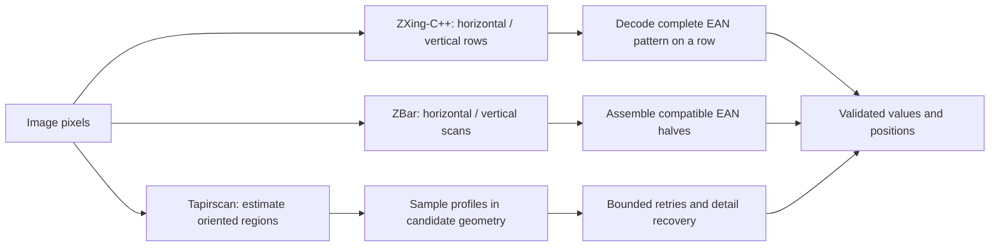

# Tapirscan, ZXing and ZBar

All three turn image pixels into barcode values. The useful distinction is
**where they look for a readable signal and how they combine that evidence**.
This comparison concerns **EAN-13 in the versions used by the demo**:
`zxing-wasm` 3.1.1 (ZXing-C++) and `@undecaf/zbar-wasm` 0.11.0.
It is not a statement about every ZXing port or every supported format.

## Three ways to find a readable pattern

|                    | ZXing-C++ / zxing-wasm                                                     | ZBar                                                                     | Tapirscan                                                                      |
| ------------------ | -------------------------------------------------------------------------- | ------------------------------------------------------------------------ | ------------------------------------------------------------------------------ |
| Initial search     | Image rows; optionally the perpendicular direction                         | Horizontal and vertical intensity scans                                  | Candidate regions estimated from barcode-like structure                        |
| EAN-13 evidence    | A complete decodable pattern along a row                                   | Compatible left/right partial reads can be assembled                     | Profiles sampled in estimated candidate geometry, followed by bounded recovery |
| Rotation           | Can read tilted symbols when an axis-aligned row still crosses the pattern | Partial-half assembly can help when different rows contain useful halves | Explicitly estimates orientation and samples diagonal paths                    |
| Geometry returned  | Positions derived from successful reads and merged confirmations           | Reported decode locations, which need not bound the whole barcode        | Source-coordinate polygons plus optional undecoded regions and crop evidence   |
| Practical tradeoff | Often economical on a clear full scanline                                  | Another way to recover fragmented EAN evidence                           | More geometric work to find useful sampling paths                              |

### Why angle matters

Imagine a short, wide barcode tilted in a photograph. A horizontal line may leave
the printed bars before reaching the last digit, while a line following the
barcode's own direction can cross the whole pattern. Taller bars give horizontal
or vertical scanning more room, so **rotation alone does not imply ZXing failure**.

The diagram simplifies the EAN-13 paths; it does not show every preprocessing,
confirmation, deduplication, or error-checking step.

## ZXing: efficient row-based decoding

The inspected ZXing-C++ 1D reader searches rows, tries each direction along a row,
and can repeat the search in the perpendicular orientation. `tryHarder` changes
how much searching it performs. The EAN-13 reader decodes the left and right digit
groups within that row; additional reads can confirm the result and extend its
reported position. This is a good fit for clear product-label images.

The precise statement is **“the EAN-13 path samples axis-aligned image rows,”**
not “ZXing cannot read rotated barcodes.” Its matrix-code readers use other
geometry, and other wrappers may preprocess or rotate images themselves.

Sources: [ZXing-C++ 1D reader](https://github.com/zxing-cpp/zxing-cpp/blob/master/core/src/oned/ODReader.cpp),
[EAN-13 reader](https://github.com/zxing-cpp/zxing-cpp/blob/master/core/src/oned/ODEAN13Reader.cpp).

## ZBar: combining partial EAN reads

ZBar retains compatible left- and right-half EAN evidence and checks the completed
value. The halves may come from different scanlines. It does **not** require
exactly two lines, and arbitrary fragments are not sufficient: the partials must
meet the decoder's structural and consistency checks.

This can help when no single scanned row contains a clean complete symbol. It
does not make orientation irrelevant, and it does not establish a fixed runtime
penalty relative to ZXing.

Sources: [ZBar EAN decoder](https://github.com/mchehab/zbar/blob/master/zbar/decoder/ean.c),
[image scanner](https://github.com/mchehab/zbar/blob/master/zbar/img_scanner.c).

### Why the ZBar overlay may cover only half the barcode

ZBar's location API exposes decode locations, not all scanned paths or a reliable
full-symbol outline. The demo draws their convex hull. Partial decode events
are not all retained as public result points, so a narrow shape is not evidence
that ZBar examined only that part of the symbol. Compare decoded values separately
from overlay coverage. [ZBar location API](https://zbar.sourceforge.net/api/zbar_8h.html)

## Tapirscan: sample along the barcode

Tapirscan first proposes oriented barcode regions, refines selected geometry,
and samples profiles from the original pixels. It attempts every primary
candidate's cheap pass before spending its retry budget. Results can retain
localized-but-undecoded regions and incomplete-work information.

Medium, High and Very high also run bounded source-detail recovery: select up
to two texture seeds, enlarge a crop threefold, and try source-guided directions
with the separately pinned Low decoder. Candidate indices stay local to their
original frame or crop; transforms place the final polygons in source coordinates.

This gives Tapirscan a way to pursue diagonal, small, or difficult barcode
signals without a ZXing/ZBar fallback or neural model. It is **designed to handle
arbitrary orientations**, not guaranteed to decode every orientation, blur level,
perspective distortion, or damaged symbol. See [architecture](ARCHITECTURE.md).

## Which is faster?

There is no reliable fixed ranking. Image size, symbol shape, selected formats,
search options, decoder build, and runtime all matter. A ZBar scan taking four
times as long as a ZXing scan on one demo image is an observation about that case.
It is not a library-wide property.

The demo offers an accessible comparison on your images. For publishable claims,
use a fixed image set and report correct instances, wrong values, missed symbols,
and latency percentiles together. The [benchmark guide](BENCHMARKS.md) describes
that protocol. A comparison of EAN-13 does not establish QR or all-format parity.
